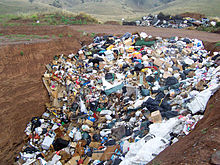
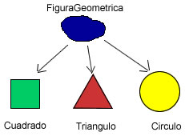

# Yepiz-Luviano-Jonathan-TareasPOO

## Paradigma: 
A lo que entendi, un paradigma es una forma que se debe llevar a cabo para alguna situacion o problema especifico.

## Abstraccion:
La abstaccion es poder visualizar algo fuera del contexto y darle un significado distinto al habitual. En programacion orientada a objetos son como las caracteristicas de un objeto con la cual se puede distinguir de otros.

Ejemplo: Una pintura, donde el significado esta mas alla de lo que podemos ver.
Un pensamiento filosofico.

## ¿Por qué decimos que la Clase es el mecanismo de abstracción de los lenguajes OO? 
Porque a la hora de programar nosotros como programadores tenemos la capacidad de darle el significado que queremos a los objetos dentro de una clase, y este puede salirse de su contexto tradicional, una clase es como si de una pintura se tratase.

## Encapsulamiento:
El encapsulamiento consiste en juntar todos los atributos, metodos y atributos de una clase en una sola entidad. Es muy importante el encapsulamiento ya que nos ayuda organizar los datos y la integridad entre estos. Y el encapsulamiento nos ayuda para poder evitar el acceso a los datos por un medio no especificado.

## Herencia:
Es la capacidad que tienen las clases de poder transmitir a otra sus atributos,metodos entre otras cosas evitando que se tengan que volverse a introducir. Una ejemplo de herencia para mi seria una clase Perro donde esta clase tendria todos los atributos y metodos generales de un perro y si despues crearamos una clase perro dalmata en lugar de volver a definir todos esos atributos, con la herencia se lo transmitiriamos y agregariamos los que faltan.

# UML: diagrama de clases.
Todo comienza en 1994 cuando Rumbaugh se unió a la compañía Rational fundada por Booch. El objetivo de ambos era unificar dos métodos que habían desarrollado: el método Booch y el OMT. 
El primer borrador apareció en octubre de 1995. En esa misma época Jacobson, se unió a Rational y se incluyeron ideas suyas. Este lenguaje se abrió a la colaboración de otras empresas para que aportaran sus ideas. Todas estas colaboraciones condujeron a la definición de la primera versión de UML. 
El desarrollo de UML comenzó a finales de 1994 cuando Grady Booch y Jim Rumbaugh de Rational Software Corporation empezaron a unificar sus métodos. A finales de 1995, Ivar Jacob son y su compañía Objectory se incorporaron a Rational en su unificación, aportando el método OOSE.
Es un lenguaje de modelado visual que se usa para especificar, visualizar, construir y documentar artefactos de un sistema de software. Se usa para entender, diseñar, configurar, mantener y controlar la información sobre los sistemas a construir.
En 1997 UML 1.1 fue aprobada por la OMG convirtiéndose en la notación estándar de facto para el análisis y el diseño orientado a objetos.
UML es el primer método en publicar un meta-modelo en su propia notación, incluyendo la notación para la mayoría de la información de requisitos, análisis y diseño.
Mediante el fomento del uso de UML OMG pretende alcanzar los siguientes objetivos:
Proporcionar a los usuarios un lenguaje de modelado visual expresivo y utilizable para el desarrollo e intercambio de modelos significativos.
Proporcionar mecanismos de extensión y especialización.
Ser independiente del proceso de desarrollo y de los lenguajes de programación.
Proporcionar una base formal para entender el lenguaje de modelado.
Fomentar el crecimiento del mercado de las herramientas OO.
Soportar conceptos de desarrollo de alto nivel como pueden ser colaboraciones, frameworks, patterns, y componentes.
Integrar las mejores prácticas utilizadas hasta el momento.

## Escribe una propuesta de una máquina que venda distintos artículos y haz el diagrama de clases del sistema que propones. 
Mi propuesta es una maquina la cual venda celulares de los dos Sistemas Operativos mas populares que son iOS y Android, donde sea capaz de buscar la opcion mas adecuada a las necesidades que el cliente este buscando, en este caso con respecto al color, S.O, almacenamiento etc..

