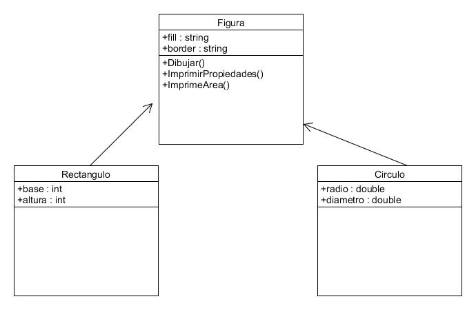

# Yepiz Luviano Jonathan
# Unidad 3 (Herencia)


### 1.  Define: Clase Base, Clase Derivada
Clase Base: La clase base es aquella que no depende de ninguna otra base, por lo regular esta clase se utiliza para heredar diversos metodos y atributos a las clases derivadas para asi poder reutilizar codigo.

Clase Derivada: Una clase derivada es aquella que depende totalmente de la clase base, esta clase surge en base a la clase base, y posee los atributos y metodos de esa clase, aunque las clases derivadas son capaces de incluir algunos mas.

### 2.  Haz un diagrama UML donde se muestre la relación de herencia entre las  clases Figura, Recangulo y Circulo como vimos en clase


### 3. Indica cuales son las clases base y las derivadas

La clase base es la de Figura ya que es la que hereda los atributos y metodos a las otras.
Mientras que la clase Circulo y rectangulo son las derivadas ya que estan heredando de una clase base.

### 4. ¿Que es herencia simple y herencia múltiple? ¿En c# se puede hacer herencia múltiple?
Herencia simple: Este es un tipo de herencia la cual al igual que las demas hereda sus atributos y metodos a una clase derivada, pero esta herencia solo es capaz de heredar a solo una clase derivada y no ha muchas.

Herencia multiple: La herencia multiple es cuando se es capaz de crear clases a partir de dos o mas clases bases, en varios lenguajes de programacion esto no es posible.

C# y la herencia multiple: Como tal no es posible aplicar la herencia multiple, pero es capaz de simularla con diversas tecnicas como la interfaces.

###  5. Escribe el programa de Figura como vimos en clase, donde agregues varios tipos de figuras a una lista y recorre la lista llamando a un metodo de las figuras

```c#
using System;
using System.Collections.Generic;

namespace Figura
{
    class Vector2d
    {
        public int x, y;
        public Vector2d(int x, int y)
        {
            this.x = x; this.y = y;
        }
        public override string ToString()
        {
            return String.Format("{0},{1}", x, y);
        }
    }

    abstract class Figura
    {
        public Vector2d position;
        public string fill, border;


        public Figura() : this(new Vector2d(100, 100))
        {

        }

        public Figura(Vector2d pos)
        {
            position = pos;
            fill = "white";
            border = "black";
        }

        public abstract void Dibuja();
    }
    class Cuadrado : Figura
    {
        private int lado;
        public Cuadrado(Vector2d pos, int lado) : base(pos)
        {
            this.lado = lado;
        }
        public Cuadrado(): base()
        {
            this.lado = 4;

        }
        public override void Dibuja()
        {
            Console.WriteLine("Se hace un cuadrado en {0} de color {1}", position, fill);
        }
}

    class Circulo : Figura
    {
        private int radio;
        public Circulo(Vector2d pos, int radio) : base(pos)
        {
            this.radio = radio;
        }
        public Circulo() : base()
        {
            this.radio = 10;
        }
   
        public override void Dibuja()
        {
            Console.WriteLine("Se dibuja un circulo en {0} de color {1}", position, fill);
        }
    }

    class Rectangulo : Figura
    {

        public Rectangulo(Vector2d pos) : base(pos)
        {

        }
        public Rectangulo() : base()
        {

        }

        public override void Dibuja()
        {
            Console.WriteLine("Se dibuja un Rectangulo en {0} de color {1}", position, fill);
        }
    }
    
    class Program
    {
        static void Main(string[] args)
        {

            List<Figura> figuras = new List<Figura>();
            figuras.Add(new Circulo());
            figuras.Add(new Rectangulo(new Vector2d(200, 200)));
            figuras.Add(new Cuadrado());
            foreach (Figura f in figuras)
                f.Dibuja();
            Console.ReadKey();
        }
    }
}
```
La palabra base sirve para llamar a un metodo de la clase base, desde la clase derivada que haya sido sobreescrito o mejor dicho que tenga un override.

      

